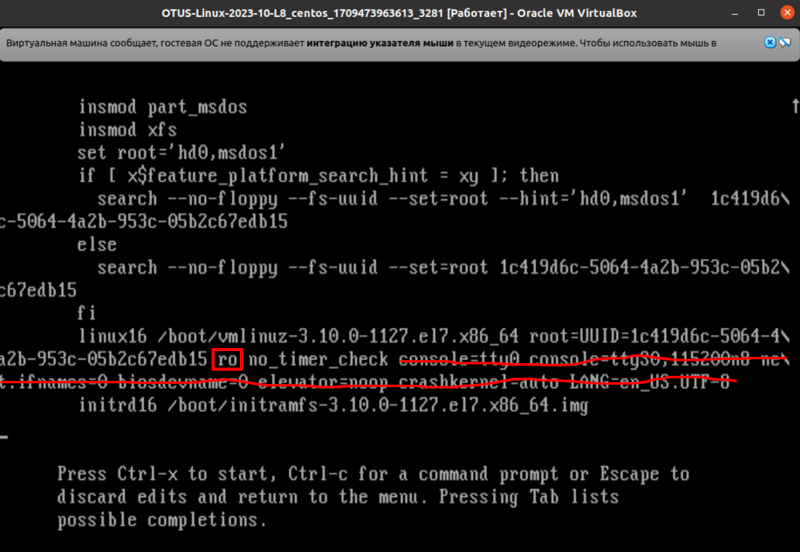
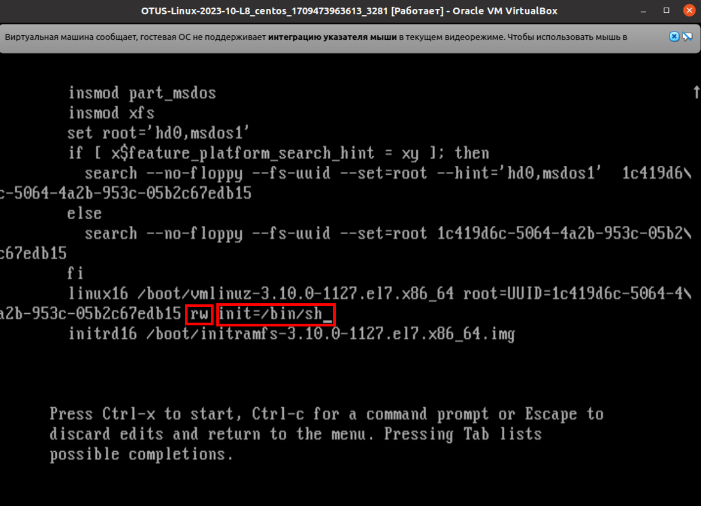
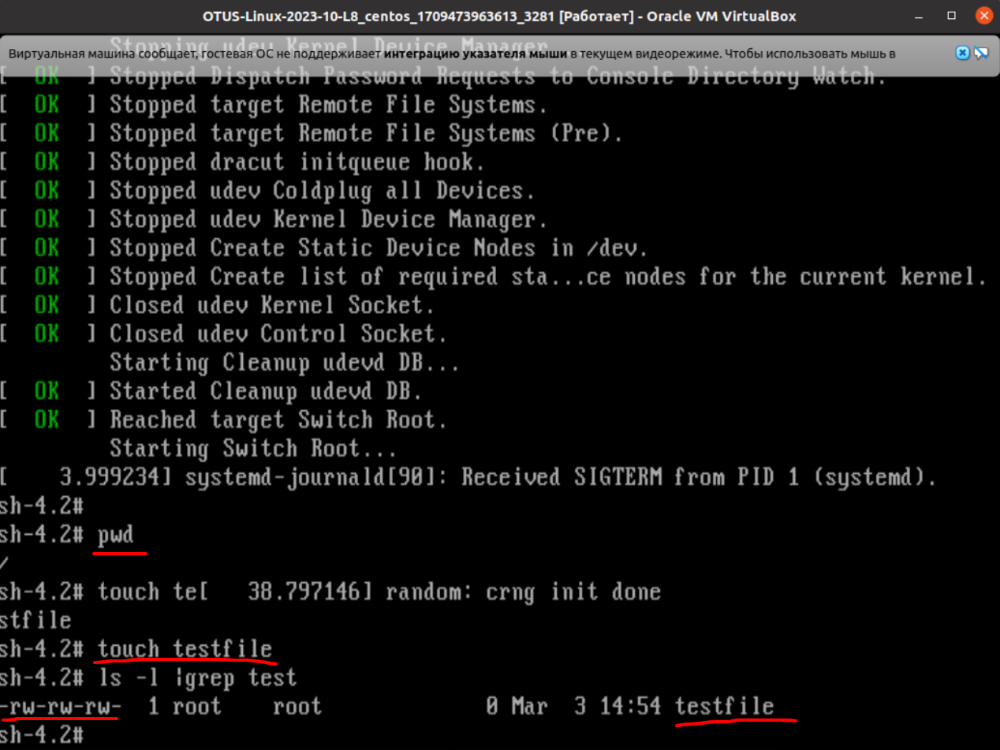
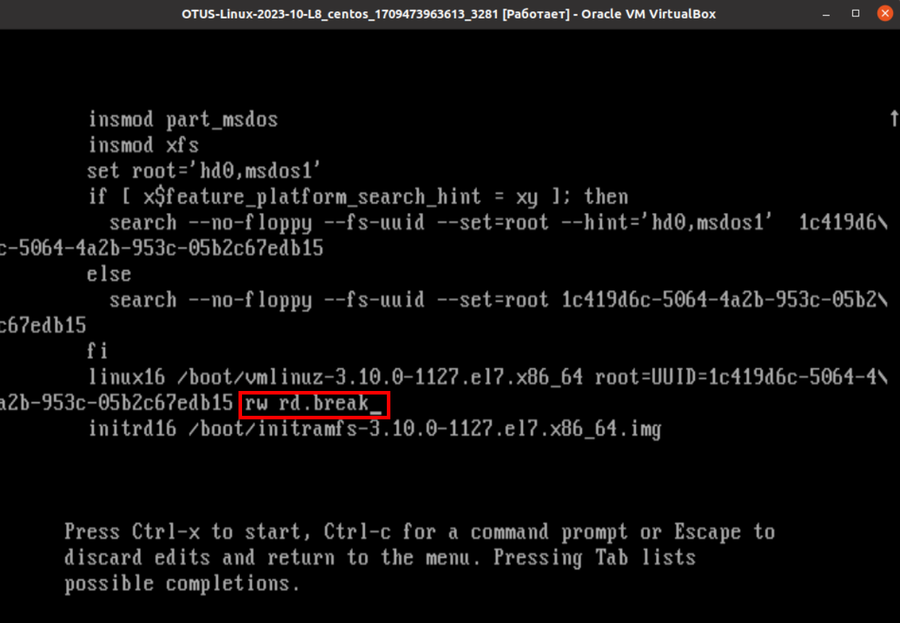
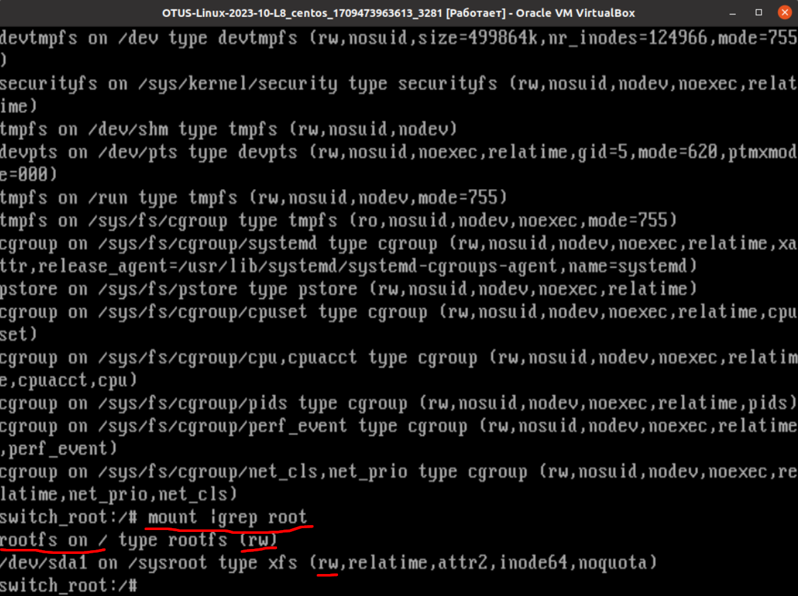
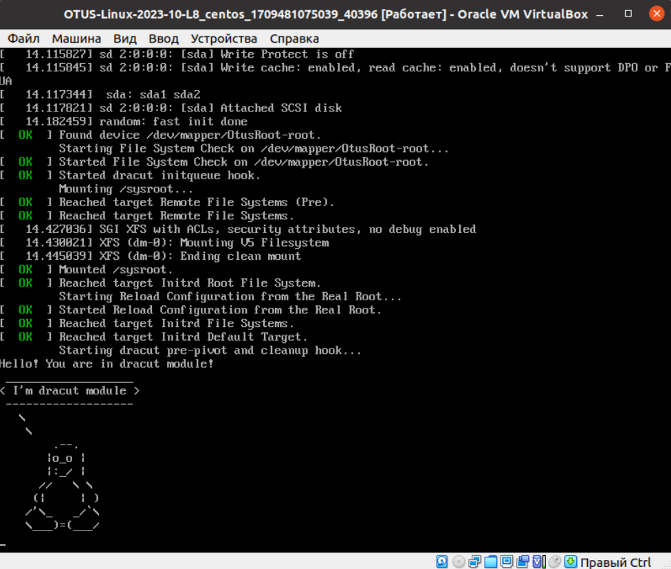

### OTUS-Linux-2023-10-L8 | GRUB

#### Попасть в систему без пароля несколькими способами

1. Способ: rw init=/bin/sh
	- изначальная настройка загрузчика выглядит так:
	
	- красным показано что менялось/удалялось
	- изменённая конфигурация:
	
	- подтверждаем что есть доступ на запись в рут-каталог:
	
2. Способ: rw rd.break
	- изменённая конфигурация:
	
	- подтверждаем что есть доступ на запись в рут-каталог:
	
3. Способ: rw init=/sysroot/bin/sh
	- приводит к такому же результату что и первый, не буду загромождать картинками.  

#### Установить систему с LVM, после чего переименовать VG 
 - Пошаговый скрипт с изменениями и проверкой, упрщённо, выглядит так: 

		[root@centos ~]# 
		[root@centos ~]# vgs
		  VG     #PV #LV #SN Attr   VSize    VFree
		  centos   1   3   0 wz--n- <126,00g 4,00m
		[root@centos ~]# 
		[root@centos ~]# vgrename centos OtusRoot
		  Volume group "centos" successfully renamed to "OtusRoot"
		[root@centos ~]#
		[root@centos ~]# nano /etc/fstab 
		[root@centos ~]# nano /etc/default/grub 
		[root@centos ~]# nano /boot/grub2/grub.cfg 
		[root@centos ~]# 
		[root@centos ~]# mkinitrd -f -v /boot/initramfs-$(uname -r).img $(uname -r)
		Executing: /sbin/dracut -f -v /boot/initramfs-3.10.0-1160.76.1.el7.x86_64.img 3.10.0-1160.76.1.el7.x86_64
		........
		*** Creating microcode section ***
		*** Created microcode section ***
		*** Creating image file done ***
		*** Creating initramfs image file '/boot/initramfs-3.10.0-1160.76.1.el7.x86_64.img' done ***
		[root@centos ~]#
		[root@centos ~]#shutdown -r 0
		[root@centos ~]# 
		[root@centos ~]# vgs
		  VG       #PV #LV #SN Attr   VSize    VFree
		  OtusRoot   1   3   0 wz--n- <126,00g 4,00m
		[root@centos ~]#

#### Добавить модуль в initrd 
 - Пошаговый скрипт с изменениями, упрщённо, выглядит так: 

		[root@centos ~]#
		[root@centos ~]# mkdir /usr/lib/dracut/modules.d/01test
		[root@centos ~]# cd /usr/lib/dracut/modules.d/01test/
		[root@centos 01test]# nano module-setup.sh
		[root@centos 01test]#
		[root@centos 01test]# ls -lh /usr/lib/dracut/modules.d/01test/
		итого 4,0K
		-rw-r--r--. 1 root root 127 мар  4 05:11 module-setup.sh
		[root@centos 01test]# 
		[root@centos 01test]# dracut -f -v
		Executing: /sbin/dracut -f -v
		......
		*** Creating image file done ***
		*** Creating initramfs image file '/boot/initramfs-3.10.0-1160.76.1.el7.x86_64.img' done ***
		[root@centos 01test]# 
		[root@centos 01test]# lsinitrd -m /boot/initramfs-$(uname -r).img | grep test
		test
		[root@centos 01test]#

 - Проверка: 
  

